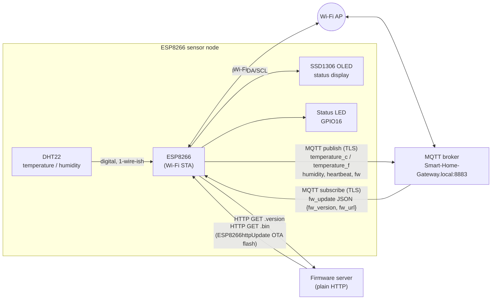

# MQTT_SSL_for_ESP8266

ESP8266 firmware for a SmartHome Gateway sensor node: reads temperature and
humidity from a DHT22, publishes the readings to a local MQTT broker over
TLS, shows live status on a small OLED display, and can self-update its
firmware over HTTP when notified over MQTT.

## What it does

- Connects to Wi-Fi and syncs the clock over SNTP.
- Opens a TLS connection to an MQTT broker (`BearSSL::WiFiClientSecure`,
  port 8883) using a locally-supplied root CA certificate — no `setInsecure()`
  fingerprint hack, the broker's certificate is actually validated against a
  trust anchor.
- Publishes a heartbeat, the running firmware version, and DHT22
  temperature/humidity readings every 5 seconds.
- Subscribes to two topics; a JSON payload with a `fw_version` newer than the
  running firmware triggers `checkForUpdates()`, which checks a version file
  over plain HTTP and, if newer, downloads and flashes a new binary via
  `ESP8266httpUpdate`.
- Mirrors Wi-Fi/MQTT/update status and the current time on an SSD1306 OLED.

## Hardware

| Component | Notes |
|---|---|
| ESP8266 board | Wemos D1 mini (or similar); adjust `board` in `platformio.ini` if different |
| DHT22 (AM2302) temperature/humidity sensor | Data pin -> GPIO12 (D6) |
| SSD1306 128x64 I2C OLED display | SDA -> GPIO5 (D1), SCL -> GPIO4 (D2), address `0x3C` |
| Status LED | GPIO16 (D0), blinks once per publish cycle |

## Required libraries

Pinned in `platformio.ini`; if building from the Arduino IDE instead, install
the equivalents through Library Manager:

- ESP8266 Arduino core (`ESP8266WiFi`, `ESP8266HTTPClient`,
  `ESP8266httpUpdate`, `WiFiClientSecureBearSSL`) — bundled with the
  `espressif8266` platform
- [PubSubClient](https://github.com/knolleary/pubsubclient) (MQTT client)
- [ArduinoJson](https://arduinojson.org/) v7 (`JsonDocument` API)
- [DHT sensor library](https://github.com/adafruit/DHT-sensor-library) (Adafruit) + Adafruit Unified Sensor
- [ESP8266 and ESP32 OLED driver for SSD1306 displays](https://github.com/ThingPulse/esp8266-oled-ssd1306) (ThingPulse) — provides `SSD1306Brzo`

## Configuration

Before building, edit the placeholders at the top of `IOTA_MQTT_SSL.ino`:

- `ssid` / `pass` — Wi-Fi credentials
- `HOSTNAME` — device hostname, also used as the MQTT client ID and topic prefix
- `MQTT_HOST` / `MQTT_PORT` / `MQTT_USER` / `MQTT_PASS` — broker connection details
- `IOT_FW_VER` / `FW_VERSION_NUMBER` — bump both on every release
- `fwUrlBase` — base URL the device polls for `<mac>.version` and `<mac>.bin`
- `digicert` — PEM root CA certificate for your MQTT broker's TLS certificate

## Build / flash

With [PlatformIO](https://platformio.org/) (recommended):

```sh
pio run                 # build
pio run -t upload       # build and flash
pio device monitor       # serial monitor at 115200 baud
```

The default environment in `platformio.ini` targets a Wemos D1 mini
(`board = d1_mini`) — change it to match your actual board.

Alternatively, in the Arduino IDE: install the ESP8266 board package and the
libraries above via Library Manager, select your board, and upload
`IOTA_MQTT_SSL.ino` directly.

> This environment did not have PlatformIO or arduino-cli installed, so the
> sketch could not be compiled to verify it builds cleanly — the changes
> below were checked by reading, not by an actual build. Please compile
> locally before flashing.

## Architecture



TLS (BearSSL, validated against a locally-supplied root CA) protects the MQTT
link end-to-end; the firmware-update check/download path is plain HTTP, as
configured by `fwUrlBase`.

## Notes on this modernization pass

- The sketch already used the modern BearSSL `WiFiClientSecure` with an
  explicit trust anchor (not the old axTLS SHA1-fingerprint pattern), so that
  part was left as-is.
- `ArduinoJson`'s `StaticJsonDocument<256>` was updated to the v7
  `JsonDocument` API.
- `HTTPClient::begin()` / `ESP8266httpUpdate.update()` now take an explicit
  `WiFiClient` argument, matching the current ESP8266 core API (a plain
  client, since the firmware URL is HTTP, not HTTPS).
- Removed dead code that had no effect at runtime: an unused hardware
  interrupt handler (`interrupt14`), an unused `blink()`/`state`/`button`
  status trio, and unused `blueLed`/`greenLed`/analog-read variables.
- Fixed a placeholder that didn't actually compile
  (`const int FW_VERSION = FIRMWARE VERSION;`) by turning it into a proper
  `#define FW_VERSION_NUMBER` placeholder.
- No change to MQTT topics, payloads, publish cadence, or TLS/auth behavior.
